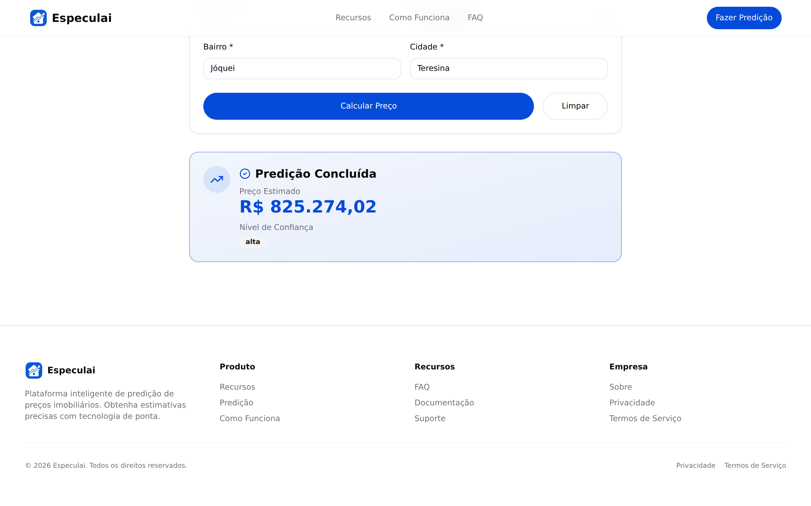
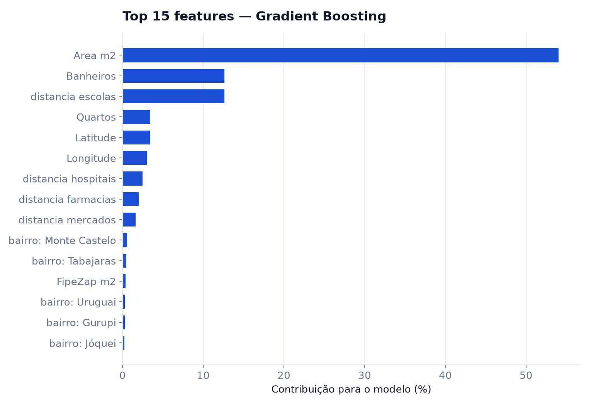
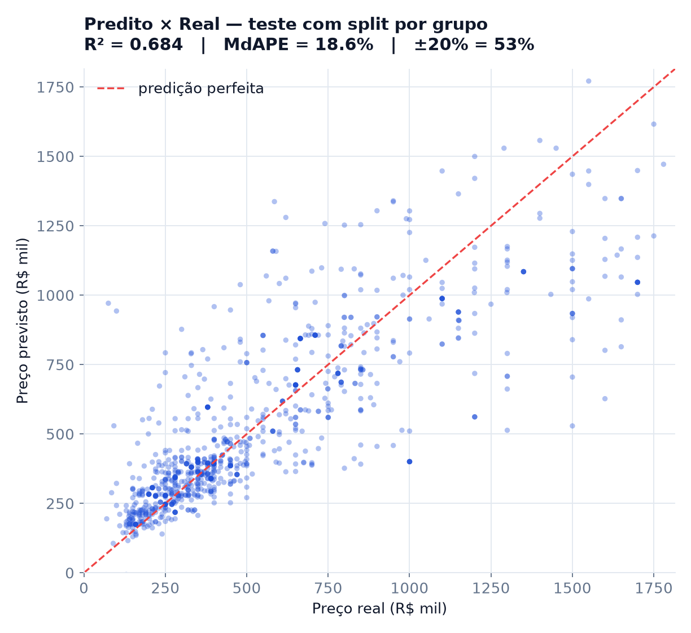
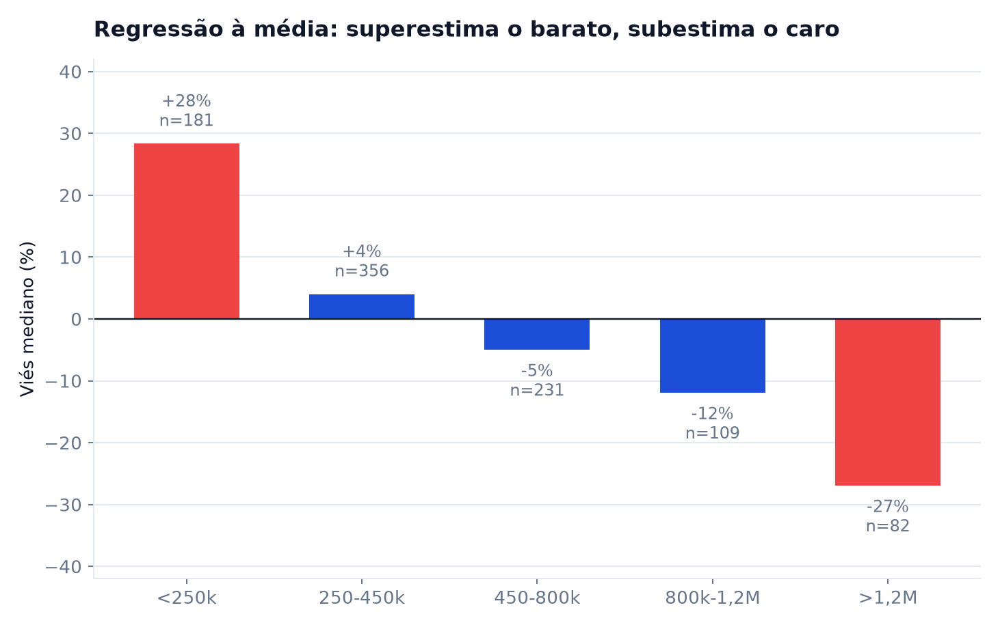
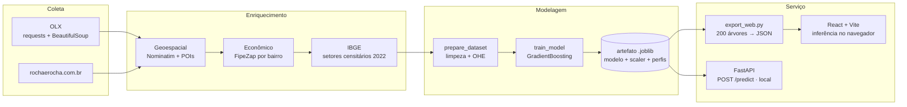

<p align="center">
  
</p>

<h1 align="center">Especulai</h1>

<p align="center">
  <strong>Estimativa de preços de <em>venda</em> de imóveis em Teresina (PI) com Machine Learning.</strong><br>
  Do scraping ao modelo em produção — que roda no seu navegador, sem servidor.
</p>

<p align="center">
  <a href="https://gutoportelaa.github.io/especulai/"><strong>▶ Ver no ar</strong></a>
</p>

<p align="center">
  
  
  
  
  
  
  
</p>

---

## O problema

Quem anuncia ou compra um imóvel em Teresina não tem uma referência objetiva de preço. Os
anúncios são a única fonte pública, e eles refletem a expectativa do vendedor — não o mercado.

O Especulai coleta esses anúncios, os enriquece com contexto geoespacial e econômico, e treina
um modelo de regressão que devolve uma estimativa em segundos, junto com um nível de confiança
que diz o quanto o modelo realmente conhece aquele tipo de imóvel naquele bairro.

**Entrada:** área, quartos, banheiros, tipo, bairro, cidade
**Saída:** preço de **venda** estimado (R$) + confiança (alta / média / baixa)

> O modelo estima **apenas venda**. Aluguel é coletado pelos scrapers e descartado no
> preparo do dataset — ver [Limitações](#limitações-conhecidas).

---

## Demonstração

<p align="center">
  
</p>

<table>
<tr>
<td width="50%"></td>
<td width="50%"></td>
</tr>
<tr>
<td align="center"><em>Formulário — seis campos, sem cadastro</em></td>
<td align="center"><em>Resultado com nível de confiança</em></td>
</tr>
</table>

O site em <https://gutoportelaa.github.io/especulai/> é **estático**: o modelo é baixado
uma vez (86 KB comprimidos) e a predição acontece no navegador, em ~75 ms. Não há
servidor, não há cold start e não há custo de operação.

### Via API local

A API FastAPI continua no repositório e é o caminho usado pelo pipeline e pelos testes —
ela só não é mais o que serve o site publicado.

```bash
make dev  # http://localhost:8000

curl -X POST http://localhost:8000/predict \
  -H 'Content-Type: application/json' \
  -d '{"area":85,"quartos":3,"banheiros":2,"tipo":"apartamento","bairro":"Jóquei","cidade":"Teresina"}'
```

```json
{ "preco_estimado": 815821.41, "confianca": "alta" }
```

O mesmo imóvel de 85 m², variando apenas o bairro — o modelo reproduz a geografia de preços da cidade:

| Bairro | Estimativa | Confiança |
|---|---:|---|
| Jóquei | R$ 815.821 | alta |
| Fátima | R$ 686.096 | alta |
| Centro | R$ 337.074 | alta |
| Itararé | R$ 311.991 | alta |
| Mocambinho | R$ 265.061 | alta |
| *(bairro fora do treino)* | R$ 396.633 | **baixa** |

---

## Resultados do modelo

Base: 5.644 anúncios coletados da OLX em 19/11/2025. Após remover 1.028 reanúncios do mesmo
imóvel e 19 registros abaixo de R$ 50 mil (aluguel misturado com venda), sobram **4.597 anúncios
únicos** em **110 bairros**.

A avaliação usa **split por grupo de imóvel**, não split aleatório: todas as cópias de um mesmo
imóvel vão para o mesmo lado da divisão. Sem isso o teste mede memorização.

| Métrica | Treino | Teste |
|---|---:|---:|
| MAE | R$ 86.208 | **R$ 136.782** |
| RMSE | R$ 121.920 | R$ 211.543 |
| R² | 0,890 | **0,684** |
| MdAPE | — | **18,6%** |
| Acertos dentro de ±20% | — | **52,6%** |

Metade das estimativas cai a menos de 19% do preço anunciado. O MdAPE é a métrica mais honesta
aqui: o MAE em reais é dominado pelos imóveis caros e o R² esconde viés sistemático.

<table>
<tr>
<td width="58%"></td>
<td width="42%"></td>
</tr>
</table>

### Quais features o modelo realmente usa

São **121**, e vale ser literal sobre elas porque a lista é menor do que o pipeline sugere:

| Origem | Features |
|---|---|
| Informado pelo usuário | `Area_m2`, `Quartos`, `Banheiros` |
| Perfil mediano do bairro | `Latitude`, `Longitude`, `distancia_farmacias`, `distancia_escolas`, `distancia_mercados`, `distancia_hospitais`, `score_comercial`, `FipeZap_m2` |
| One-hot | 110 colunas `Bairro_*` |

Ou seja: **o usuário move três números e escolhe um bairro.** Todo o resto é preenchido a partir
do bairro. O que *não* está na lista importa tanto quanto o que está:

- **`Tipo_Imovel` não existe** — não há nenhuma coluna `Tipo_*`. O formulário pergunta
  apartamento ou casa, e a resposta só afeta o rótulo de confiança.
- **`Vagas_Garagem` e `Descricao_Length`** eram colunas constantes de zeros e são removidas
  automaticamente no treino.
- **`FipeZap_Diferenca_m2`** é vazamento de alvo (≡ `Valor_Anuncio/Area_m2 − FipeZap_m2`) e é
  removida explicitamente. Era ela que inflava o R² para 0,99.
- **`Densidade_Comodos`, `Preco_m2`, `Total_Dependencias`** são criadas em `prepare_dataset.py`
  mas não estão no dataset versionado — a feature engineering inteira está inerte.

### As features de localização não medem o que o nome diz

Área responde por 54% da decisão do modelo e banheiros por 13%. Em terceiro aparece
`distancia_escolas`, com 12,6% — e é aqui que mora um problema.

`distancia_escolas` **não é a distância até a escola mais próxima**. É a distância geodésica até
um único ponto fixo no bairro Ininga, definido à mão em `POI_REFERENCE_POINTS`. O mesmo vale
para farmácias, mercados e hospitais: quatro pontos arbitrários no mapa. Verificado contra o
cálculo direto, o erro máximo é de 0,005 m — são a mesma coisa.

Ou seja, as quatro "proximidades" são coordenadas polares em torno de quatro pontos, e estão
correlacionadas entre si entre 0,59 e 0,90. Elas codificam posição, não acesso a serviços.

A ablação confirma que carregam pouca informação própria:

| Configuração | R² | MdAPE |
|---|---:|---:|
| Completo | 0,684 | 18,8% |
| Sem as 4 distâncias e `score_comercial` | 0,674 | 19,2% |
| Sem `Latitude`/`Longitude` | 0,670 | 18,3% |
| Sem nenhuma geo contínua (só one-hot de bairro) | 0,668 | 19,7% |

Remover **toda** a geografia contínua custa 1,6 ponto de R² e 0,9 ponto de MdAPE. O one-hot de
bairro já carrega quase toda a informação de localização que o modelo usa hoje.

Isso não significa que localização importe pouco — significa que **ela ainda não foi medida
direito**. Ver [Roadmap](#roadmap).

### Vale mais que a regra de bolso?

O concorrente real não é "chutar a média" — é o que um corretor faz de cabeça: área multiplicada
pelo preço por m² típico do bairro.

| Estimador | MAE | MdAPE | Dentro de ±20% |
|---|---:|---:|---:|
| Mediana global | R$ 271.850 | 46,8% | 24,9% |
| Área × R$/m² global | — | 31,5% | 31,3% |
| Área × R$/m² do bairro (regra do corretor) | — | 24,0% | 44,4% |
| **Gradient Boosting** | **R$ 136.782** | **18,6%** | **52,6%** |

O modelo ganha, mas por margem modesta: 24,0% → 18,6% de erro mediano, e 8 pontos a mais de
acerto dentro de ±20%. O MAE das regras de bolso é omitido porque outliers de área (há anúncios
com `Area_m2` de 8 milhões) o tornam absurdo — o MdAPE é robusto a isso.

### Onde o modelo erra

<p align="center">
  
</p>

| Faixa | n | MdAPE | Viés mediano |
|---|---:|---:|---:|
| < R$ 250k | 181 | 29,2% | **+28,3%** |
| R$ 250–450k | 356 | 12,9% | +4,0% |
| R$ 450–800k | 231 | 18,6% | −5,0% |
| R$ 800k–1,2M | 109 | 18,3% | −11,9% |
| > R$ 1,2M | 82 | 27,0% | **−27,0%** |

Regressão à média clássica. O modelo é confiável no miolo do mercado (R$ 250–450 mil, onde está
a massa dos dados) e sistematicamente enviesado nos extremos — justo onde uma estimativa
independente seria mais útil. **Use com cautela fora da faixa central.**

### Validação externa

O R$/m² implícito nas predições tem mediana de **R$ 5.829**. O
[FipeZap para Teresina em jul/2026](https://myside.com.br/guia-imoveis/valor-metro-quadrado-teresina-pi)
aponta **R$ 6.026** — diferença de 3,3%.

Os dados são de novembro de 2025 e a cidade valorizou 6,38% em 12 meses, o que implica **+4,5%
de defasagem** nos ~9 meses decorridos. Ou seja: no agregado, o modelo está calibrado, e a
defasagem temporal é o menor dos seus problemas.

### Dois vazamentos que foram removidos

**1. Feature derivada do alvo.** Uma versão anterior reportava R² = 0,99. A feature
`FipeZap_Diferenca_m2` era, por identidade exata (erro de 6e-14),
`Valor_Anuncio / Area_m2 − FipeZap_m2`. O modelo não aprendia preço — invertia uma equação.
Removida, o R² caiu para 0,79.

**2. Anúncios duplicados no split.** Mesmo com a feature removida, 0,79 continuava otimista:
o dataset tinha 5.644 linhas para 4.614 URLs, com um imóvel chegando a aparecer 27 vezes. No
split aleatório, cópias caíam em treino e teste. Com deduplicação e split por grupo, o número
real é **0,684**.

O treino hoje rejeita colunas derivadas do alvo (`LEAKAGE_COLUMNS`), deduplica por URL e agrupa
por imóvel físico antes de dividir — as três coisas em `ml/pipeline/train_model.py`.

---

## Arquitetura



O site publicado segue o caminho `G → H → I`: o modelo é exportado para JSON e avaliado no
cliente. O ramo `G → J` é a API local, usada pelo pipeline e pelos testes.

Os cinco estágios são coordenados por `PipelineOrchestrator`, que persiste progresso em
`data/pipeline_status.json` e pula estágios já concluídos — reexecutar o pipeline é idempotente.

### Como o serviço monta as features

O usuário informa seis campos, mas o modelo espera 121. A diferença é preenchida por
precedência — no `ModelService` (Python) e, de forma idêntica, no `features.js` (navegador):

1. **Entrada do usuário** — área, quartos, banheiros
2. **One-hot do bairro** — casado por normalização (sem acento, sem caixa)
3. **Perfil mediano do bairro** — coordenadas, distâncias a POIs e FipeZap, calculados no
   treino a partir dos imóveis daquele bairro (95 dos 110 bairros têm perfil)
4. **Mediana global** — para o que sobrar

O passo 4 importa mais do que parece: preencher com `0.0` faria cada coluna virar um outlier de
vários desvios após o `StandardScaler`, e a predição colapsava para um valor constante,
insensível à entrada. Era exatamente o que acontecia antes desta correção.

O nível de confiança sai daí: bairro desconhecido → `baixa`; bairro conhecido mas sem perfil,
tipo atípico ou área fora de 20–1000 m² → `média`; caso contrário → `alta`.

As duas implementações precisam concordar até o centavo, e isso é verificado por teste:
`tests/test_web_export_parity.py` confere as árvores exportadas contra o sklearn em 8 casos
fixos e 300 aleatórios; `model.test.js` confere o preço final contra fixtures geradas pelo
pytest. Duas armadilhas custaram caro e estão documentadas no `CLAUDE.md`: arredondar
thresholds errava o preço em até 1,3%, e as árvores do sklearn comparam `X` já convertido
para float32 — o JS precisa de `Math.fround`.

---

## Começando

**Pré-requisitos:** Python 3.11+, [uv](https://docs.astral.sh/uv/), [bun](https://bun.sh), Node 18+

```bash
git clone https://github.com/gutoportelaa/especulai.git
cd especulai

make install        # dependências Python (uv sync)
make train          # treina o modelo com o dataset versionado (~30s)
make dev            # API em http://localhost:8000
```

Em outro terminal:

```bash
make web-install
make web-dev        # interface em http://localhost:5173
```

O repositório inclui `data/dataset_treino_olx_final.csv` (5.644 anúncios já enriquecidos), então
`make train` funciona logo após o clone — sem precisar rodar o scraping antes.

### Publicando o site

`frontend/public/model/especulai.json` é versionado, então o frontend funciona logo após o
clone, sem treinar nada. Depois de um `make train`, regenere e **commite** o JSON — senão o
site continua servindo o modelo antigo:

```bash
make export-web     # exporta as 200 árvores para frontend/public/model/
make deploy-web     # build estático em frontend/dist/
```

O deploy é automático: qualquer push em `main` que toque `frontend/**` dispara
`.github/workflows/deploy-web.yml`.

### Rodando em portas alternativas

```bash
make dev PORT=8010                                    # API
ALLOWED_ORIGINS="http://localhost:5174" make dev PORT=8010   # CORS para outra origem
cd frontend && bunx vite --port 5174                  # frontend
```

O frontend **não** consome a API — o modelo roda no navegador. A variável que importa é
`VITE_BASE`, o subcaminho onde o site será servido (`/especulai/` no GitHub Pages, `/` em
domínio próprio):

```bash
make deploy-web WEB_BASE=/
```

---

## API

A API é **local**: o site publicado não a utiliza. Documentação interativa em
`http://localhost:8000/docs`.

Os endpoints de pipeline e scraping disparam scraping e retreino, então ficam
**desmontados fora de desenvolvimento** (respondem `404`). Para habilitá-los:

```bash
ENABLE_PIPELINE_API=true PIPELINE_API_TOKEN=<segredo> make start
curl -H 'Authorization: Bearer <segredo>' -X POST localhost:8000/api/v1/pipeline/reset
```

Habilitar sem definir o token em produção devolve `403`, não acesso aberto.

| Método | Rota | Descrição |
|---|---|---|
| `GET` | `/` | Health check raiz |
| `GET` | `/health` | Health check detalhado |
| `POST` | `/predict` | Estimativa de preço |
| `POST` | `/api/v1/pipeline/run` | Dispara o pipeline em background |
| `GET` | `/api/v1/pipeline/status` | Estágio atual e progresso |
| `GET` | `/api/v1/pipeline/logs` | Últimas linhas de log |
| `GET` | `/api/v1/pipeline/stages` | Descrição dos estágios |
| `GET` | `/api/v1/pipeline/info` | Metadados do modelo carregado |
| `POST` | `/api/v1/pipeline/reset` | Reseta o estado do pipeline |
| `POST` | `/api/v1/scrape/start` | ⚠️ Stub — retorna `501` |

**`POST /predict`**

```jsonc
// requisição
{
  "area": 85.0,        // m², > 0
  "quartos": 3,        // >= 0
  "banheiros": 2,      // >= 0
  "tipo": "apartamento", // "apartamento" | "casa"
  "bairro": "Jóquei",
  "cidade": "Teresina"
}

// resposta
{ "preco_estimado": 825274.02, "confianca": "alta" }
```

Se nenhum modelo estiver carregado, a API não quebra: cai num fallback
`área × preço_mediano_por_m²` e devolve `confianca: "baixa"`.

---

## Comandos

```bash
# Backend (uv)
make install     make dev        make start      make kill-port

# Frontend (bun)
make web-install make web-dev    make web-build  make web-check

# ML
make scrape      make prepare    make train      make pipeline

# Qualidade
make lint        make typecheck  make test       make ci
```

`make help` lista tudo com descrição.

---

## Estrutura

```
especulai/
├── apps/
│   ├── api/                 # FastAPI: main, routes/, services/, models/
│   └── scraper/             # scraper_olx.py, scraper_rocha.py
├── ml/
│   ├── pipeline/            # orchestrator, prepare_dataset, train_model
│   │   └── modules/         # enriquecimento geoespacial / econômico / IBGE
│   └── artifacts/           # modelos .joblib (gerados por make train)
├── frontend/                # React 19 + Vite + Tailwind
│   └── src/                 # api/ components/ features/ hooks/ pages/
├── config/paths.py          # caminhos canônicos do projeto
├── data/                    # dataset versionado + intermediários do pipeline
├── docs/                    # guias e screenshots
└── Makefile                 # ponto de entrada único
```

---

## Stack

| Camada | Tecnologia |
|---|---|
| Serviço | Site estático (GitHub Pages) · inferência no navegador, sem runtime de ML |
| API (local) | FastAPI · Uvicorn · Pydantic v2 |
| ML | scikit-learn (GradientBoostingRegressor) · pandas · NumPy · joblib |
| Coleta | requests · BeautifulSoup4 |
| Geo | geopy (Nominatim) · malha de setores censitários IBGE 2022 |
| Frontend | React 19 · Vite 5 · Tailwind 3 · framer-motion · lucide-react |
| Testes | pytest · bun:test (paridade Python↔JS) |
| Tooling | uv · bun · Ruff · basedpyright · Biome |

---

## Limitações conhecidas

Este é um projeto em evolução, e vale ser explícito sobre onde ele está:

- **Preço de anúncio ≠ preço de venda.** O modelo aprende a pedida do vendedor. O desconto real
  de negociação não está nos dados.
- **Só venda.** Não há modelo de aluguel. Os scrapers coletam aluguel (467 dos 1.164 anúncios
  do Rocha & Rocha), mas o preparo do dataset descarta tudo que não é venda. Até 11/08/2026 a
  separação era feita só por um piso de R$ 50 mil no treino — heurística que deixava passar
  4 de 467 aluguéis e descartava 7 de 696 vendas. O filtro explícito por `Tipo_Negocio` já está
  no `prepare_dataset.py`, mas **o modelo publicado ainda é o anterior**: só vale no próximo
  retreino. A viabilidade de um modelo de aluguel separado está medida em
  [`docs/modelo-aluguel.md`](docs/modelo-aluguel.md) — falta cerca de 10× mais dado.
- **O campo `tipo` não afeta o preço.** Não existe nenhuma coluna `Tipo_Imovel_*` entre as 121
  features do modelo. O formulário coleta apartamento/casa, e isso só influencia o rótulo de
  confiança. Mesma origem: as features de engenharia (`Densidade_Comodos`, `Total_Dependencias`)
  também não chegaram ao dataset versionado.
- **Cobertura de testes ainda parcial.** A paridade Python↔JS do modelo web está coberta nos
  dois lados; pipeline, scrapers e rotas da API seguem sem teste.
- **`POST /api/v1/scrape/start` é um stub** que retorna `501`. O scraping roda por CLI
  (`make scrape`).
- **Viés nos extremos:** +28% abaixo de R$ 250 mil, −27% acima de R$ 1,2 milhão.
- **Distâncias a POIs medem distância a um ponto fixo**, não à instalação mais próxima — ver a
  seção sobre features de localização.
- **Fatores FipeZap por bairro estão hardcoded** em `enriquecimento_economico.py`.
- **Snapshot único:** todos os dados são de 19/11/2025. Sem série temporal, o modelo não capta
  tendência; a defasagem estimada hoje é de +4,5%.
- **Escopo geográfico:** apenas Teresina (PI).

## Roadmap

A localização é o eixo com maior retorno potencial, e é o menos explorado. Em ordem de valor
esperado por esforço:

- [ ] **Recoletar volume da OLX** — virou o item nº 1. A cadeia bruta da OLX se perdeu; sobrou
      só o dataset já preparado, sem `Tipo_Negocio` nem `Tipo_Imovel`. Sem recoletar, os dois
      problemas acima não têm conserto e o filtro explícito de aluguel fica inerte.
- [ ] **Renda por setor censitário (IBGE 2022)** — o módulo já existe
      (`ml/pipeline/modules/enriquecimento_ibge.py`) e a correlação entre renda média do
      responsável no setor e preço/m² é de **0,58**. Mas ligá-la ao modelo do Rocha *piorou* o
      R² de teste (0,34 → 0,27): em n=429, adiciona mais variância que sinal. Depende de volume.
- [ ] **POIs reais via OSM Overpass + KDTree** — já construídos e disponíveis no dataset do
      Rocha & Rocha. Medidos em 2026-08-11, rendem **1 ponto percentual de R²**; o gargalo não é
      a qualidade da feature, é volume de amostra.
- [ ] **CEP como chave de localização** — resolução muito mais fina que bairro. Depende de
      extrair o CEP do anúncio, que a OLX nem sempre expõe.
- [ ] **Modelo de aluguel** — arquitetura resolvida (segundo JSON + alternador na interface;
      ver [`docs/modelo-aluguel.md`](docs/modelo-aluguel.md)), mas **bloqueado por dado**: os 137
      aluguéis residenciais utilizáveis produzem R² **−0,19**, que empata com chutar a mediana.
      A meta medida é 1.200–1.800 anúncios residenciais, ~10× o que existe hoje.
- [ ] **Levar `tipo` para dentro do modelo** — o campo é pedido ao usuário e ignorado; o
      one-hot de `Tipo_Imovel` se perdeu no caminho até o dataset versionado.
- [ ] Intervalo de predição em vez de ponto estimado, e correção do viés por faixa
- [x] ~~Deploy público~~ — no ar em <https://gutoportelaa.github.io/especulai/>, estático,
      com o modelo rodando no navegador
- [ ] Ampliar a suíte de testes para pipeline e scrapers (a paridade do modelo web já está coberta)
- [ ] Coleta recorrente para construir série temporal e permitir retreino

> **Zona eleitoral foi descartada.** O recorte é administrativo-eleitoral, desenhado para
> equilibrar número de eleitores, e não acompanha a segmentação do mercado imobiliário. O setor
> censitário do IBGE resolve o mesmo problema com granularidade melhor e traz renda, densidade e
> número de moradores junto.

---

## Documentação

| Arquivo | Conteúdo |
|---|---|
| [`CONTEXT.md`](CONTEXT.md) | Diagnóstico técnico e melhorias priorizadas |
| [`CLAUDE.md`](CLAUDE.md) | Guia de engenharia: convenções, estrutura, tech debt |
| [`docs/GUIA_TREINAMENTO.md`](docs/GUIA_TREINAMENTO.md) | Pipeline de ponta a ponta |
| [`docs/investigacao-geografica.md`](docs/investigacao-geografica.md) | **Quanto a localização explica o preço** — coleta com endereço, POIs reais e o resultado |
| [`docs/modelo-aluguel.md`](docs/modelo-aluguel.md) | **Modelo de aluguel** — por que dois modelos, o que os 137 anúncios atuais produzem e quanto dado falta |
| [`docs/notas-de-pesquisa.md`](docs/notas-de-pesquisa.md) | Anotações brutas de pesquisa (scraping, geocodificação, IBGE) |
| [`notebooks/`](notebooks/) | Comparação de modelos e avaliação de métricas |

---

## Licença

MIT — veja [LICENSE](LICENSE).
