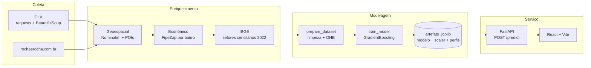

<p align="center">
  
</p>

<h1 align="center">Especulai</h1>

<p align="center">
  <strong>Estimativa de preços de imóveis em Teresina (PI) com Machine Learning.</strong><br>
  Do scraping ao modelo em produção, servido por uma API REST e uma interface React.
</p>

<p align="center">
  
  
  
  
  
  
</p>

---

## O problema

Quem anuncia ou compra um imóvel em Teresina não tem uma referência objetiva de preço. Os
anúncios são a única fonte pública, e eles refletem a expectativa do vendedor — não o mercado.

O Especulai coleta esses anúncios, os enriquece com contexto geoespacial e econômico, e treina
um modelo de regressão que devolve uma estimativa em segundos, junto com um nível de confiança
que diz o quanto o modelo realmente conhece aquele tipo de imóvel naquele bairro.

**Entrada:** área, quartos, banheiros, tipo, bairro, cidade
**Saída:** preço estimado (R$) + confiança (alta / média / baixa)

---

## Demonstração

<p align="center">
  
</p>

<table>
<tr>
<td width="50%"></td>
<td width="50%"></td>
</tr>
<tr>
<td align="center"><em>Formulário — seis campos, sem cadastro</em></td>
<td align="center"><em>Resultado com nível de confiança</em></td>
</tr>
</table>

### Via API

```bash
curl -X POST http://localhost:8000/predict \
  -H 'Content-Type: application/json' \
  -d '{"area":85,"quartos":3,"banheiros":2,"tipo":"apartamento","bairro":"Jóquei","cidade":"Teresina"}'
```

```json
{ "preco_estimado": 825274.02, "confianca": "alta" }
```

O mesmo imóvel de 85 m², variando apenas o bairro — o modelo reproduz a geografia de preços da cidade:

| Bairro | Estimativa | Confiança |
|---|---:|---|
| Jóquei | R$ 825.274 | alta |
| Fátima | R$ 664.883 | alta |
| Centro | R$ 359.991 | alta |
| Itararé | R$ 310.371 | alta |
| Mocambinho | R$ 309.135 | alta |
| *(bairro fora do treino)* | R$ 396.932 | **baixa** |

---

## Resultados do modelo

Treinado com **5.644 anúncios** da OLX cobrindo **110 bairros** de Teresina, split 80/20.

| Métrica | Treino | Teste |
|---|---:|---:|
| MAE | R$ 88.111 | **R$ 114.225** |
| RMSE | R$ 123.952 | R$ 170.176 |
| R² | 0,894 | **0,792** |

Com preço mediano de R$ 430.000 no conjunto, o erro médio de ~R$ 114 mil equivale a cerca de
26% do valor típico. É um resultado de baseline honesto para dados de anúncio, não de transação.

<table>
<tr>
<td width="58%"></td>
<td width="42%"></td>
</tr>
</table>

Área responde por ~55% da decisão do modelo, seguida por distância a escolas (~16%) e número
de banheiros (~10%) — as features geoespaciais derivadas do enriquecimento entram logo depois.

### Sobre o vazamento de alvo que foi removido

Uma versão anterior deste modelo reportava **R² = 0,99**. O número era falso.

A feature `FipeZap_Diferenca_m2` era, por construção, idêntica a
`Valor_Anuncio / Area_m2 − FipeZap_m2` — uma transformação algébrica do próprio alvo. O modelo
não estava aprendendo preço; estava invertendo uma equação. Removida a coluna, o R² caiu de
0,99 para 0,79, que é o desempenho real.

O treino hoje rejeita explicitamente colunas derivadas do alvo (`LEAKAGE_COLUMNS` em
`ml/pipeline/train_model.py`), para que a regressão não volte silenciosamente.

---

## Arquitetura



Os cinco estágios são coordenados por `PipelineOrchestrator`, que persiste progresso em
`data/pipeline_status.json` e pula estágios já concluídos — reexecutar o pipeline é idempotente.

### Como o serviço monta as features

O usuário informa seis campos, mas o modelo espera 123. A diferença é preenchida por
precedência, no `ModelService`:

1. **Entrada do usuário** — área, quartos, banheiros
2. **One-hot do bairro** — casado por normalização (sem acento, sem caixa)
3. **Perfil mediano do bairro** — coordenadas, distâncias a POIs e FipeZap, calculados no
   treino a partir dos imóveis daquele bairro (95 dos 110 bairros têm perfil)
4. **Mediana global** — para o que sobrar

O passo 4 importa mais do que parece: preencher com `0.0` faria cada coluna virar um outlier de
vários desvios após o `StandardScaler`, e a predição colapsava para um valor constante,
insensível à entrada. Era exatamente o que acontecia antes desta correção.

O nível de confiança sai daí: bairro desconhecido → `baixa`; bairro conhecido mas sem perfil,
tipo atípico ou área fora de 20–1000 m² → `média`; caso contrário → `alta`.

---

## Começando

**Pré-requisitos:** Python 3.11+, [uv](https://docs.astral.sh/uv/), [bun](https://bun.sh), Node 18+

```bash
git clone https://github.com/gutoportelaa/especulai.git
cd especulai

make install        # dependências Python (uv sync)
make train          # treina o modelo com o dataset versionado (~30s)
make dev            # API em http://localhost:8000
```

Em outro terminal:

```bash
make web-install
make web-dev        # interface em http://localhost:5173
```

O repositório inclui `data/dataset_treino_olx_final.csv` (5.644 anúncios já enriquecidos), então
`make train` funciona logo após o clone — sem precisar rodar o scraping antes.

### Rodando em portas alternativas

```bash
make dev PORT=8010                                    # API
ALLOWED_ORIGINS="http://localhost:5174" make dev PORT=8010   # CORS para outra origem
cd frontend && bunx vite --port 5174                  # frontend
```

O frontend lê a URL da API de `VITE_API_URL` (`frontend/.env.local`):

```
VITE_API_URL=http://localhost:8010
```

---

## API

Documentação interativa em `http://localhost:8000/docs`.

| Método | Rota | Descrição |
|---|---|---|
| `GET` | `/` | Health check raiz |
| `GET` | `/health` | Health check detalhado |
| `POST` | `/predict` | Estimativa de preço |
| `POST` | `/api/v1/pipeline/run` | Dispara o pipeline em background |
| `GET` | `/api/v1/pipeline/status` | Estágio atual e progresso |
| `GET` | `/api/v1/pipeline/logs` | Últimas linhas de log |
| `GET` | `/api/v1/pipeline/stages` | Descrição dos estágios |
| `GET` | `/api/v1/pipeline/info` | Metadados do modelo carregado |
| `POST` | `/api/v1/pipeline/reset` | Reseta o estado do pipeline |
| `POST` | `/api/v1/scrape/start` | ⚠️ Stub — retorna `501` |

**`POST /predict`**

```jsonc
// requisição
{
  "area": 85.0,        // m², > 0
  "quartos": 3,        // >= 0
  "banheiros": 2,      // >= 0
  "tipo": "apartamento", // "apartamento" | "casa"
  "bairro": "Jóquei",
  "cidade": "Teresina"
}

// resposta
{ "preco_estimado": 825274.02, "confianca": "alta" }
```

Se nenhum modelo estiver carregado, a API não quebra: cai num fallback
`área × preço_mediano_por_m²` e devolve `confianca: "baixa"`.

---

## Comandos

```bash
# Backend (uv)
make install     make dev        make start      make kill-port

# Frontend (bun)
make web-install make web-dev    make web-build  make web-check

# ML
make scrape      make prepare    make train      make pipeline

# Qualidade
make lint        make typecheck  make test       make ci
```

`make help` lista tudo com descrição.

---

## Estrutura

```
especulai/
├── apps/
│   ├── api/                 # FastAPI: main, routes/, services/, models/
│   └── scraper/             # scraper_olx.py, scraper_rocha.py
├── ml/
│   ├── pipeline/            # orchestrator, prepare_dataset, train_model
│   │   └── modules/         # enriquecimento geoespacial / econômico / IBGE
│   └── artifacts/           # modelos .joblib (gerados por make train)
├── frontend/                # React 19 + Vite + Tailwind
│   └── src/                 # api/ components/ features/ hooks/ pages/
├── config/paths.py          # caminhos canônicos do projeto
├── data/                    # dataset versionado + intermediários do pipeline
├── docs/                    # guias e screenshots
└── Makefile                 # ponto de entrada único
```

---

## Stack

| Camada | Tecnologia |
|---|---|
| API | FastAPI · Uvicorn · Pydantic v2 |
| ML | scikit-learn (GradientBoostingRegressor) · pandas · NumPy · joblib |
| Coleta | requests · BeautifulSoup4 |
| Geo | geopy (Nominatim) · malha de setores censitários IBGE 2022 |
| Frontend | React 19 · Vite 5 · Tailwind 3 · framer-motion · lucide-react |
| Tooling | uv · bun · Ruff · basedpyright · Biome |

---

## Limitações conhecidas

Este é um projeto em evolução, e vale ser explícito sobre onde ele está:

- **Preço de anúncio ≠ preço de venda.** O modelo aprende a pedida do vendedor. O desconto real
  de negociação não está nos dados.
- **Sem testes automatizados.** `make test` existe, o diretório `tests/` ainda não.
- **`POST /api/v1/scrape/start` é um stub** que retorna `501`. O scraping roda por CLI
  (`make scrape`).
- **Distâncias a POIs usam um ponto fixo por categoria**, não a instalação mais próxima de fato.
  Migrar para OSM Overpass + KDTree é o próximo passo do enriquecimento.
- **Fatores FipeZap por bairro estão hardcoded** em `enriquecimento_economico.py`.
- **Escopo geográfico:** apenas Teresina (PI).

## Roadmap

- [ ] Suíte de testes (pytest) cobrindo pipeline e API
- [ ] Distâncias a POIs via Overpass + KDTree
- [ ] Features do IBGE (renda por setor censitário) no modelo principal — a correlação medida
      entre renda do setor e preço/m² foi de **0,58**
- [ ] Intervalo de predição, não só ponto estimado
- [ ] Retreino agendado com dados novos
- [ ] Deploy público (API + frontend)

---

## Documentação

| Arquivo | Conteúdo |
|---|---|
| [`CONTEXT.md`](CONTEXT.md) | Diagnóstico técnico e melhorias priorizadas |
| [`CLAUDE.md`](CLAUDE.md) | Guia de engenharia: convenções, estrutura, tech debt |
| [`docs/GUIA_TREINAMENTO.md`](docs/GUIA_TREINAMENTO.md) | Pipeline de ponta a ponta |
| [`docs/notas-de-pesquisa.md`](docs/notas-de-pesquisa.md) | Anotações brutas de pesquisa (scraping, geocodificação, IBGE) |
| [`notebooks/`](notebooks/) | Comparação de modelos e avaliação de métricas |

---

## Licença

MIT — veja [LICENSE](LICENSE).
